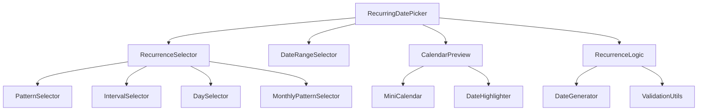

# Design Document

## Overview

The recurring date picker component is designed as a modular, reusable React component that provides comprehensive recurring date selection capabilities. The component follows a layered architecture with clear separation of concerns between UI presentation, business logic, and state management.

The design leverages React's component composition pattern, modern hooks for state management, and a clean API for integration into any React application. The component will be built using TypeScript for type safety and Tailwind CSS for styling.

## Architecture

### High-Level Architecture



### Component Hierarchy

- **RecurringDatePicker** (Main Container)
  - **RecurrenceSelector** (Pattern Configuration)
    - **PatternSelector** (Daily/Weekly/Monthly/Yearly)
    - **IntervalSelector** (Every X units)
    - **DaySelector** (Weekday selection)
    - **MonthlyPatternSelector** (Complex monthly patterns)
  - **DateRangeSelector** (Start/End date selection)
  - **CalendarPreview** (Visual preview)
    - **MiniCalendar** (Calendar grid)
    - **DateHighlighter** (Highlight recurring dates)
  - **RecurrenceLogic** (Business logic utilities)

## Components and Interfaces

### Core Types and Interfaces

```typescript
// Core types
type RecurrencePattern = "daily" | "weekly" | "monthly" | "yearly";
type WeekDay =
  | "monday"
  | "tuesday"
  | "wednesday"
  | "thursday"
  | "friday"
  | "saturday"
  | "sunday";
type MonthlyPattern = "same-date" | "day-of-week";
type Ordinal = "first" | "second" | "third" | "fourth" | "last";

// Main configuration interface
interface RecurrenceConfig {
  pattern: RecurrencePattern;
  interval: number;
  startDate: Date;
  endDate?: Date;
  weeklyDays?: WeekDay[];
  monthlyPattern?: MonthlyPattern;
  monthlyOrdinal?: Ordinal;
  monthlyWeekDay?: WeekDay;
}

// Component props
interface RecurringDatePickerProps {
  initialConfig?: Partial<RecurrenceConfig>;
  onConfigChange: (config: RecurrenceConfig) => void;
  onDatesGenerated: (dates: Date[]) => void;
  maxPreviewDates?: number;
  className?: string;
  disabled?: boolean;
}

// Generated result
interface RecurrenceResult {
  config: RecurrenceConfig;
  generatedDates: Date[];
  isValid: boolean;
  validationErrors: string[];
}
```

### Component Specifications

#### 1. RecurringDatePicker (Main Component)

**Purpose:** Main container component that orchestrates all sub-components and manages the overall state.

**Props:**

- `initialConfig`: Optional initial configuration
- `onConfigChange`: Callback when configuration changes
- `onDatesGenerated`: Callback when dates are generated
- `maxPreviewDates`: Maximum dates to show in preview (default: 50)
- `className`: Additional CSS classes
- `disabled`: Disable the entire component

**State Management:**

- Uses `useReducer` for complex state management
- Manages recurrence configuration
- Handles validation state
- Controls preview generation

#### 2. RecurrenceSelector

**Purpose:** Handles all recurrence pattern selection and configuration.

**Sub-components:**

- **PatternSelector**: Radio buttons for basic patterns
- **IntervalSelector**: Number input for custom intervals
- **DaySelector**: Checkboxes for weekday selection
- **MonthlyPatternSelector**: Dropdowns for complex monthly patterns

#### 3. DateRangeSelector

**Purpose:** Manages start and end date selection with validation.

**Features:**

- Date input fields with validation
- Calendar popup for date selection
- Range validation (end date after start date)
- Clear visual feedback for invalid ranges

#### 4. CalendarPreview

**Purpose:** Provides visual preview of generated recurring dates.

**Features:**

- Mini calendar grid showing multiple months
- Highlighted recurring dates
- Navigation between months
- Hover tooltips showing date information
- Responsive design for different screen sizes

## Data Models

### State Management Model

```typescript
// Main state structure
interface RecurringDatePickerState {
  config: RecurrenceConfig;
  generatedDates: Date[];
  validationErrors: Record<string, string>;
  isGenerating: boolean;
  previewMonth: Date;
}

// State actions
type RecurringDatePickerAction =
  | { type: "SET_PATTERN"; payload: RecurrencePattern }
  | { type: "SET_INTERVAL"; payload: number }
  | { type: "SET_START_DATE"; payload: Date }
  | { type: "SET_END_DATE"; payload: Date | undefined }
  | { type: "SET_WEEKLY_DAYS"; payload: WeekDay[] }
  | {
      type: "SET_MONTHLY_PATTERN";
      payload: {
        pattern: MonthlyPattern;
        ordinal?: Ordinal;
        weekDay?: WeekDay;
      };
    }
  | { type: "GENERATE_DATES"; payload: Date[] }
  | { type: "SET_VALIDATION_ERROR"; payload: { field: string; error: string } }
  | { type: "CLEAR_VALIDATION_ERROR"; payload: string }
  | { type: "SET_PREVIEW_MONTH"; payload: Date };
```

### Date Generation Algorithm

The date generation logic will be implemented in a separate utility module:

```typescript
class DateGenerator {
  static generateRecurringDates(
    config: RecurrenceConfig,
    maxDates: number = 50
  ): Date[] {
    // Implementation will handle:
    // - Daily patterns with custom intervals
    // - Weekly patterns with specific day selection
    // - Monthly patterns (same date vs day-of-week)
    // - Yearly patterns
    // - End date boundaries
    // - Edge cases (leap years, month boundaries)
  }

  static validateConfig(config: RecurrenceConfig): ValidationResult {
    // Validation logic for configuration
  }
}
```

## Error Handling

### Validation Strategy

1. **Real-time Validation**: Validate inputs as user types
2. **Configuration Validation**: Validate complete configuration before date generation
3. **Date Generation Validation**: Handle edge cases during date generation

### Error Types

```typescript
interface ValidationError {
  field: string;
  message: string;
  severity: "error" | "warning";
}

// Common validation scenarios
const ValidationRules = {
  startDate: (date: Date) => date >= new Date(),
  endDate: (start: Date, end: Date) => end > start,
  interval: (interval: number) => interval > 0 && interval <= 365,
  weeklyDays: (days: WeekDay[]) => days.length > 0,
  monthlyPattern: (config: RecurrenceConfig) => {
    // Validate monthly pattern completeness
  },
};
```

### Error Display

- Inline validation messages below form fields
- Summary of errors at component level
- Visual indicators (red borders, icons) for invalid fields
- Accessible error announcements for screen readers

## Testing Strategy

### Unit Testing Approach

1. **Date Generation Logic**

   - Test all recurrence patterns with various configurations
   - Edge cases: leap years, month boundaries, DST transitions
   - Boundary conditions: start/end dates, intervals
   - Invalid configurations and error handling

2. **Component Logic**

   - State management and reducer functions
   - Validation functions
   - Configuration transformations
   - Event handlers

3. **Utility Functions**
   - Date manipulation utilities
   - Validation helpers
   - Formatting functions

### Integration Testing

1. **Complete User Workflows**

   - Select pattern → Configure options → Generate dates → Preview
   - Change configuration → Update preview
   - Validation error scenarios

2. **Component Interactions**
   - Parent-child component communication
   - State synchronization across components
   - Event propagation and handling

### Testing Tools and Setup

```typescript
// Test utilities
interface TestConfig {
  pattern: RecurrencePattern;
  interval: number;
  startDate: string; // ISO string for consistency
  endDate?: string;
  expectedDates: string[]; // Expected generated dates
}

// Test data sets
const testScenarios: TestConfig[] = [
  {
    pattern: "weekly",
    interval: 2,
    startDate: "2024-01-01",
    endDate: "2024-03-01",
    expectedDates: [
      "2024-01-01",
      "2024-01-15",
      "2024-01-29",
      "2024-02-12",
      "2024-02-26",
    ],
  },
  // Additional test scenarios...
];
```

### Performance Considerations

1. **Date Generation Optimization**

   - Limit preview dates to reasonable number (50-100)
   - Lazy loading for large date ranges
   - Memoization of expensive calculations

2. **Component Rendering**

   - React.memo for sub-components
   - useMemo for expensive computations
   - useCallback for event handlers

3. **Calendar Preview**
   - Virtual scrolling for large date ranges
   - Efficient date highlighting algorithms
   - Debounced configuration updates

## Accessibility

### WCAG Compliance

1. **Keyboard Navigation**

   - Tab order through all interactive elements
   - Arrow key navigation in calendar
   - Enter/Space activation for buttons

2. **Screen Reader Support**

   - Proper ARIA labels and descriptions
   - Live regions for dynamic content updates
   - Semantic HTML structure

3. **Visual Accessibility**
   - High contrast color schemes
   - Focus indicators
   - Scalable text and UI elements

### Implementation Details

```typescript
// Accessibility props example
interface AccessibilityProps {
  "aria-label"?: string;
  "aria-describedby"?: string;
  "aria-expanded"?: boolean;
  "aria-selected"?: boolean;
  role?: string;
}
```

## Styling and Theming

### Tailwind CSS Implementation

The component will use Tailwind CSS with a consistent design system:

```css
/* Component-specific utilities */
.date-picker-container {
  @apply bg-white border border-gray-200 rounded-lg shadow-sm p-6;
}

.pattern-selector {
  @apply grid grid-cols-2 md:grid-cols-4 gap-3;
}

.pattern-option {
  @apply flex items-center justify-center p-3 border-2 border-gray-200 rounded-md cursor-pointer transition-colors;
}

.pattern-option.selected {
  @apply border-blue-500 bg-blue-50 text-blue-700;
}

.calendar-preview {
  @apply mt-6 p-4 bg-gray-50 rounded-md;
}

.calendar-grid {
  @apply grid grid-cols-7 gap-1 text-sm;
}

.calendar-date {
  @apply w-8 h-8 flex items-center justify-center rounded hover:bg-gray-100;
}

.calendar-date.recurring {
  @apply bg-blue-500 text-white hover:bg-blue-600;
}
```

### Responsive Design

- Mobile-first approach
- Collapsible sections on small screens
- Touch-friendly interactive elements
- Adaptive calendar layout

This design provides a solid foundation for implementing a comprehensive, user-friendly recurring date picker component that meets all the specified requirements while maintaining high code quality and accessibility standards.
